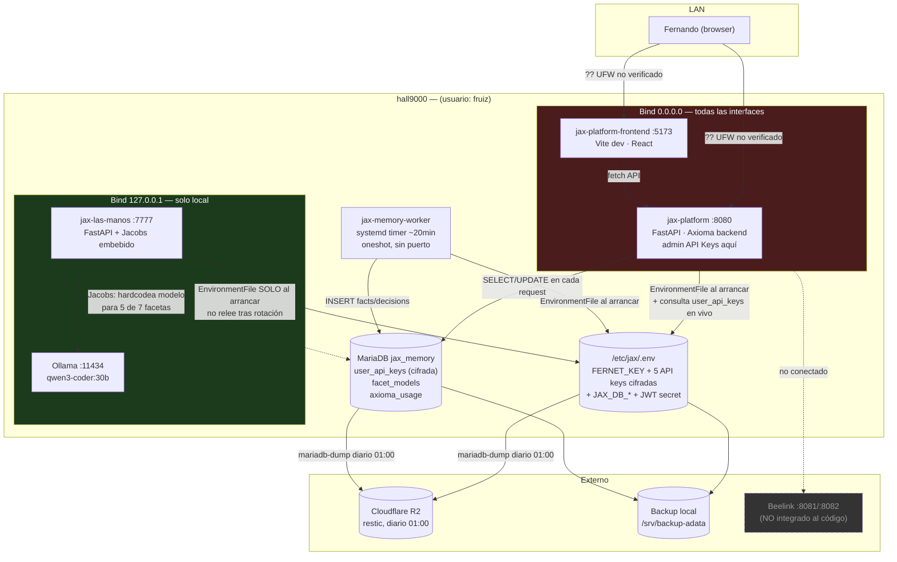

# Auditoría READ-ONLY — Pantalla API Keys de Axioma Admin

**Fecha:** 2026-08-09
**Alcance:** diagnóstico puro, sin cambios de código, sin migraciones, sin reinicios. Base para el rediseño del esquema (credencial / catálogo de modelos / binding faceta→modelo), que se discute en un paso posterior.
**Repos auditados:** `/home/fruiz/jax` (núcleo JAX, `las_manos`, `jacobs`) y `/home/fruiz/jax-platform` (Axioma backend + frontend).
**Método:** 3 sub-auditorías de código/DB en paralelo (P1+P4, P2, P5) + verificación directa de infraestructura en vivo (P6) por el orquestador, siguiendo protocolo Hyde (explicar antes de ejecutar, contrastar después). P3 resuelto por búsqueda directa.

---

## 1. Resumen ejecutivo

- Las API keys de proveedor SÍ están cifradas at-rest con **Fernet** (`cryptography.fernet`), en la tabla `user_api_keys` y en `/etc/jax/.env` — pero la **llave de cifrado (`FERNET_KEY`) vive en el mismo archivo/host** que protege, junto con las credenciales de la DB que da acceso a la copia cifrada. El cifrado no resiste el compromiso del propio host.
- **`jax-platform:8080` (que sirve el admin de API Keys) escucha en `0.0.0.0`, no en loopback** — confirmado con `ss -tlnp`. No se pudo verificar el estado real de UFW (sin sudo interactivo); es la incertidumbre más crítica de esta auditoría.
- Existen **dos fuentes de credenciales que pueden divergir**: la tabla `user_api_keys` (consultada en vivo por el admin de Axioma) y `/etc/jax/.env` vía `EnvironmentFile` de systemd (leído **una sola vez al arrancar** por `jax-las-manos`/`jacobs`). Rotar una key desde el admin **no** actualiza `jax-las-manos` hasta un `systemctl restart` manual — no automatizado por el flujo de rotación.
- **Jacobs ignora `facet_models` para 5 de 7 facetas**: `jekyll`/`hipatia`/`thot`/`ada`/`jax_local` tienen el modelo hardcodeado como literal en `jacobs/executor.py`. Cambiar el modelo activo desde el admin de Axioma solo afecta el camino "Mesa web", no Jacobs.
- No hay versionado de keys (una rotación sobreescribe sin backup), no hay validación de la key nueva antes de guardarla, y no hay audit log de quién rotó/vio/borró una key — solo un chequeo de rol (`require_superadmin`).
- Existen **10 listas paralelas** de nombres de faceta mantenidas a mano en 3 sistemas distintos (REPL, Mesa web, Jacobs), sin derivación mecánica entre ellas — ya hay evidencia real de desincronización (`admin/keys.py` dice `gpt-4o` para thot; el resto del sistema usa `gpt-5.5`).
- HAMMURABI no tiene código propio en ningún repo — es un producto futuro; el único artefacto relacionado es un pipeline de Jacobs que investigó su dominio (regulaciones CNBS), no una integración.
- El backup diario (restic, Local + Cloudflare R2, 01:00) sí cubre `jax_memory` completo, incluida `user_api_keys` cifrada, y se completó exitosamente hoy y ayer — pero el paso de retención (`forget+prune`) en R2 **falla consistentemente** en las últimas 3 corridas observadas.
- `jax_local` apunta exclusivamente a Ollama local (`127.0.0.1:11434`) — el nodo Beelink mencionado en la infraestructura global **no tiene ninguna referencia en el código**, no está conectado al pipeline de facetas actual.
- `axioma_usage.cost_usd` es 0.00 en el 100% de las filas de chat observadas — el tracking de costo real está roto independientemente de esta auditoría, hallazgo colateral relevante si el rediseño toca esa tabla.

---

## 2. Respuestas P1–P6

### P1 — Cifrado de credenciales

**P1a — DDL real:**
```sql
CREATE TABLE `user_api_keys` (
  `id` int(11) NOT NULL AUTO_INCREMENT,
  `user_id` int(11) NOT NULL DEFAULT 1,
  `provider_id` varchar(50) NOT NULL,
  `env_key` varchar(100) NOT NULL,
  `encrypted_value` text NOT NULL,
  `created_at` datetime DEFAULT current_timestamp(),
  `updated_at` datetime DEFAULT current_timestamp() ON UPDATE current_timestamp(),
  PRIMARY KEY (`id`),
  UNIQUE KEY `uk_user_provider` (`user_id`,`provider_id`),
  CONSTRAINT `user_api_keys_ibfk_1` FOREIGN KEY (`user_id`) REFERENCES `jax_users` (`user_id`) ON DELETE CASCADE
) ENGINE=InnoDB AUTO_INCREMENT=434 DEFAULT CHARSET=utf8mb4 COLLATE=utf8mb4_uca1400_ai_ci
```
Fuente en código: `jax-platform/backend/db/migrations.py:75-104` (coincide con el DDL real salvo collation). 5 filas vivas hoy (`openai`, `deepseek`, `gemini`, `moonshot`, `zhipu`), todas `user_id=1`. No existe ninguna otra tabla con API keys de proveedor en `jax_memory`.

**P1b — ¿Cifradas at-rest? Algoritmo y ubicación:**
Sí, **Fernet** (AES-128-CBC + HMAC-SHA256), `cryptography.fernet` (`jax-platform/backend/crypto_secrets.py:2`).
- Cifrar: `crypto_secrets.py:20-24` (`encrypt_secret`), invocado desde `PUT /api/admin/keys/{provider_id}` en `api/admin/keys.py:195`.
- Descifrar: `crypto_secrets.py:40-52` (`decrypt_db_secret`), invocado en `keys.py:90,105`.
- Sync a disco: `keys.py:42-50` (`_write_env_key`) reescribe `/etc/jax/.env` con el valor cifrado y actualiza `os.environ` en memoria del proceso actual.
- Al arranque de `jax-platform`: `main.py:13-14` llama `decrypt_provider_keys_in_env()` (`crypto_secrets.py:55-64`) — descifra en memoria, no toca el archivo.
- Réplica idéntica del lado de `jax`: `/home/fruiz/jax/jax/core/crypto_secrets.py` y `/home/fruiz/jax/las_manos/crypto_secrets.py` (comentadas explícitamente como espejo mínimo), invocada en `las_manos/server.py:39-40` y consumida también en `jax/muscles/base.py:166-176`.

**P1c — Ubicación de `FERNET_KEY` (riesgo confirmado):**
`/etc/jax/.env` contiene, en el mismo archivo: `FERNET_KEY`, las 5 API keys cifradas, y `JAX_DB_USER`/`JAX_DB_PASSWORD` (acceso a la DB donde vive la copia cifrada en `user_api_keys`). Permisos `-rw-rw---- root:fruiz` (modo 660) — no world-readable, pero **cualquier proceso corriendo como `fruiz`** (que es el usuario de los 4 servicios JAX y de la sesión interactiva) puede leerlo íntegro. Quien comprometa este host obtiene simultáneamente la llave y el acceso a los datos cifrados por ambas vías (archivo y DB).

**P1d — Logging sin enmascarar:**
Búsqueda `grep -rnE "(logger\.\w+|print)\([^)]*\b(api_key|secret|token|password)\b"` sobre ambos repos: **0 fugas reales**. 3 coincidencias en `jax/workspace/verify_motor_registry.py:79,91,103` son un test de políticas que imprime `reason`/`allowed`, no el valor del secreto — verificado el contexto, no es una fuga.

**P1e — Roles y audit log:**
Todos los endpoints `/api/admin/keys*` usan `Depends(require_superadmin)` (`api/admin/keys.py:123-225`), que valida `user.role == "superadmin"` sobre el JWT decodificado (`auth/middleware.py:22-25`) — control de rol simple, sin scopes granulares. **No existe tabla de audit log** en el schema (`SHOW TABLES LIKE '%audit%'` → 0 filas). El único módulo llamado "audit" (`api/audit.py`) lee un `.jsonl` de LAS MANOS, protegido solo con `get_current_user` (no `require_superadmin`), y ningún código de `keys.py` escribe ahí al rotar/borrar una key.

### P2 — Acoplamiento de facetas en Jacobs

**P2a — Inventario de literales hardcodeados:** exhaustivo, decenas de coincidencias por faceta en `jacobs/executor.py`, `jacobs/models.py`, `jacobs/plan.py`, `jacobs/routes.py`, `jacobs/policy.py`, `jax/core/router.py`, `jax/core/main.py`, `jax/memory/db.py`, `las_manos/envelope.py`, `las_manos/config.toml`, `jax-platform/backend/api/chat.py`, `api/admin/keys.py`, `db/seed.py`, `jax_engine/state.py`. (Listado línea por línea completo entregado por el sub-agente, disponible bajo pedido — resumido aquí por espacio.) Nota: `jax/_director_patch/*` contiene literales pero **no está importado por ningún módulo activo** — código muerto.

**P2b — ¿Hay indirección real?** Coexisten **tres arquitecturas distintas, no unificadas**:
- **REPL** (`jax/core/main.py`): indirección real vía `config.toml` → `build_muscles()` genérico, sin `if` por nombre de faceta.
- **Mesa web** (`jax-platform/backend/api/chat.py`): indirección real vía DB — `_resolve_active_model()` (`chat.py:338-355`) consulta `facet_models WHERE is_active=TRUE` **en cada request**; `config.toml` solo es fallback.
- **Jacobs** (`jacobs/executor.py`): **sin indirección real**, salvo Hyde. `_invoke_hipatia` (línea 263: `model = "gemini-2.5-flash"`), `_invoke_jekyll` (línea 332: `"deepseek-v4-flash"`), `_invoke_thot` (línea 363: `"gpt-5.5"`), `_invoke_ada` (línea 404: `"glm-5.2"`), `_invoke_jax_local` (línea 460: `"qwen3:14b"`) son literales fijos en Python, ignoran `facet_models` y `config.toml`. Único caso con indirección real: Hyde (`_get_active_model("hyde", ...)`, línea 485, sí consulta `facet_models`).
- **Consecuencia verificable**: activar `gpt-5.6-sol` para `thot` desde el admin cambia el chat web, pero Jacobs sigue invocando `gpt-5.5` hasta editar `executor.py:363` a mano.

**P2c — Ruta de resolución (Jacobs):** `POST /jacobs/pipeline` (`routes.py:98`) → `validate_create` (`policy.py:32`) → `PlanBuilder.build()` (`plan.py:150`) → `run_pipeline()` (`executor.py:884`) → `_dispatch_step()` (`executor.py:837`) → `if/elif` literal por faceta (`executor.py:754-772`) → `_invoke_*` (HTTP directo, o `_invoke_motor` vía `las_manos:7777/motor/dispatch` para Kimi, o `subprocess_exec` para Hyde).

**P2d — ¿Qué se rompe si se borra una faceta?** Vía `facet_models` (DB): nada, todos los resolutores tienen fallback fail-open. Vía `config.toml`: en el REPL, `main.py:277` accede al dict de muscles sin `.get()` → `KeyError` no manejado si el router (que tiene su propia lista `VALID_FACETAS` independiente) enruta ahí. El problema estructural real: **10 listas paralelas** de nombres de faceta sin fuente única (`router.py` × 5 estructuras, `jacobs/models.py` y `jacobs/plan.py` con `VALID_FACETS` duplicado sin import compartido, `chat.py` con keyword-sets paralelas, `jax_engine/state.py` con `FACET_COLORS`, `admin/keys.py` con `PROVIDERS` — este último ya desincronizado: dice `gpt-4o` para thot mientras el resto usa `gpt-5.5`).

**P2e — Hyde/jax_local vs facetas API:** dentro de Jacobs, el punto de entrada (`_dispatch_step`) es compartido por las 7, pero se bifurca en 4 mecanismos heterogéneos (HTTP directo / motor registry HTTP / Ollama HTTP / subprocess con gate humano). Fuera de Jacobs, **REPL y Mesa web tienen cada uno su propio despachador independiente** — 3 despachadores en total en el ecosistema, ninguno comparte código con los otros dos.

### P3 — Frontera con Hammurabi

**P3a-c:** No existe código de HAMMURABI en ningún repo (`jax` ni `jax-platform`). Confirmado por búsqueda `grep -rli hammurabi` en ambos: solo aparece en documentación de visión (`jax/CONTEXT.md:10`: *"fundación futura para AteneaERP y HAMMURABI"*) y un artefacto (`jax/workspace/hammurabi-credito-pipeline-001.json`, `CONTEXT.md:144`) que es el **resultado de un pipeline de Jacobs** (Hipatia→Jekyll→Thot) investigando qué componentes necesitaría un módulo de crédito bancario hondureño — no código, no integración. **No hay acoplamiento que aislar** porque no hay nada que aislar todavía: HAMMURABI es 100% conceptual en este momento.

### P4 — Rotación de keys

**P4a — Trazado del botón "Rotar":** Frontend `AdminApiKeys.jsx:259-264,275-300,101-114` → `PUT /api/admin/keys/{provider_id}`. Backend `keys.py:185-207`: cifra (línea 195) → `INSERT ... ON DUPLICATE KEY UPDATE` en `user_api_keys` (líneas 199-204) → `_write_env_key` reescribe `/etc/jax/.env` completo (línea 206) → retorna `{"ok": true}` **sin validar contra el proveedor real**.

**P4b — ¿Versiona o sobreescribe?** Sobreescribe inmediatamente, sin versionado ni historial — no hay columna `is_active`/soft-delete en `user_api_keys`, el `UPDATE` destruye el valor cifrado anterior sin dejar rastro.

**P4c — Downtime / cache / divergencia post-rotación:** **Hallazgo central para el rediseño.** No es uniforme entre procesos:
- `jax-platform`: efecto inmediato (actualiza `os.environ` en memoria, sin caché para las keys, proceso único sin `--workers`).
- `jax-las-manos` + `jacobs` (embebido en el mismo proceso): lee `os.environ` poblado **una sola vez al arrancar** vía `EnvironmentFile` de systemd. **Nunca vuelve a leer `/etc/jax/.env` ni `user_api_keys`.** Requiere `systemctl restart jax-las-manos` explícito — que el flujo de rotación **no dispara automáticamente**.
- REPL: una sesión ya abierta sigue con la key vieja hasta reiniciarla; una sesión nueva sí recoge el cambio (si ya está escrito en el archivo).
- `user_api_keys` (DB) no la lee ni `jax-las-manos` ni el REPL ni las llamadas reales del chat web — solo la lee el propio panel admin. Es decir, **la tabla es la fuente de verdad para la UI, pero no para el tráfico real de producción**, que usa `os.environ`.

**P4d — Fallos / rollback:** No hay backup de la key anterior, no hay validación previa a guardar (el test es un botón separado y manual), no hay transacción atómica entre el `UPDATE` de DB y la reescritura de `/etc/jax/.env` — un fallo a mitad de camino puede dejar DB y archivo desincronizados sin que el sistema lo detecte.

### P5 — Inventario del modelo actual

**P5a — DDL completo** (`user_api_keys` en P1a): `facet_models` —
```sql
CREATE TABLE `facet_models` (
  `id` int(11) NOT NULL AUTO_INCREMENT,
  `facet` varchar(50) NOT NULL,
  `provider_id` varchar(50) NOT NULL,
  `model_name` varchar(100) NOT NULL,
  `is_active` tinyint(1) NOT NULL DEFAULT 0,
  `added_by` varchar(100) DEFAULT NULL,
  `created_at` timestamp NULL DEFAULT current_timestamp(),
  PRIMARY KEY (`id`),
  UNIQUE KEY `uk_facet_model` (`facet`,`model_name`)
) ENGINE=InnoDB AUTO_INCREMENT=22 DEFAULT CHARSET=utf8mb4 COLLATE=utf8mb4_uca1400_ai_ci
```
Datos reales: 19 filas vivas, 7 facetas, entre 1 y 4 modelos cada una. `axioma_config` (config genérico, sin secretos) y `axioma_usage` (log de uso/costo) completan el set de tablas relacionadas — no existe tabla `providers` separada, esa lista vive hardcodeada en Python (`admin/keys.py:17-23`).

**P5b — Endpoints:** `GET/PUT/DELETE /api/admin/keys[/{id}[/test]]` (`api/admin/keys.py`), `GET/POST/PUT/DELETE /api/admin/facet-models/{facet}[/...]` (`api/admin/facet_models.py`), todos bajo `require_superadmin`.

**P5c — Componentes React:** `AdminApiKeys.jsx` (337 líneas) es el único componente que consume ambos endpoints, montado en `pages/Admin.jsx:21` (`/admin/keys`), enlazado desde `AdminSidebar.jsx:6`.

**P5d — Origen de las opciones del `<select>`:** 100% desde la DB. `AdminApiKeys.jsx` hace `GET /admin/facet-models/{facet}` (líneas 23-34) → backend `SELECT ... FROM facet_models WHERE facet = %s ORDER BY is_active DESC` (`facet_models.py:10-39`) → `<select>` renderiza `models.map(...)` (línea 154-156). Si la faceta no tiene filas, cae a un fallback estático hardcodeado en `PROVIDERS` de `keys.py:17-23`. La lista de **proveedores** (no modelos) sí está hardcodeada en Python — agregar un proveedor nuevo hoy requiere editar código, no la DB.

**P5e — Alias vs versión fijada:** No existe ningún campo que distinga ambos conceptos; `model_name` es texto libre sin validación contra catálogo. Tampoco se captura el campo `model` que el proveedor devuelve en su respuesta JSON (verificado por grep en `jax/muscles/base.py`, `jax-platform/backend/api/chat.py`) — el sistema registra lo que *cree* haber pedido, nunca lo que el proveedor confirma haber ejecutado.

**P5f — Semántica de "active":** Dos significados distintos y no relacionados en la misma pantalla:
1. `facet_models.is_active` — booleano manual, togglea el admin vía transacción de 2 UPDATEs (exclusividad a nivel aplicación, no trigger, por limitación de MariaDB documentada en el propio código). Este SÍ decide el modelo real en el camino Mesa web.
2. `status: "active"/"missing"` en `GET /admin/keys` — calculado en cada request (`keys.py:142`) como "hay un valor no vacío guardado", **sin** health-check real; el resultado del botón "Probar" vive solo en estado de React, no se persiste.

**Hallazgo colateral (P5f):** `axioma_usage.model` se recalcula desde `config.toml` estático (`chat.py:606-608`), no reutiliza el modelo real resuelto por `_resolve_active_model()` — puede atribuir costo al modelo viejo tras una rotación de modelo activo. Además `tokens_in`/`tokens_out` se pasan siempre en 0 → `cost_usd` es 0.00 en el 100% de la muestra revisada.

### P6 — Topología de ejecución

**P6a — Dónde corre cada cosa** (verificado con `systemctl show`, host `Hall9000`):

| Servicio | Puerto | Bind | Gestor | Usuario | WorkingDirectory | Habilitado al boot |
|---|---|---|---|---|---|---|
| jax-platform | 8080 | **0.0.0.0** | systemd (`uvicorn`) | fruiz | `/home/fruiz/jax-platform/backend` | sí (`enabled`) |
| jax-platform-frontend | 5173 | **0.0.0.0** | systemd (`node`/vite dev) | fruiz | `/home/fruiz/jax-platform/frontend` | sí (`enabled`) |
| jax-las-manos | 7777 | 127.0.0.1 | systemd (`uvicorn`) | fruiz | `/home/fruiz/jax/las_manos` | sí (`enabled`) |
| jax-memory-worker | — (oneshot, sin puerto) | — | systemd timer (`~20 min`) | fruiz | `/home/fruiz/jax` | `static` + timer `enabled` — **sí está activo**, corrió a las 02:10 de hoy |
| Ollama | 11434 | 127.0.0.1 | (fuera de alcance, no es unidad JAX) | — | — | — |

No hay Docker/compose, tmux, screen ni nohup sueltos — las 4 unidades JAX son servicios systemd nativos en el mismo host físico.

**P6b — ¿Misma fuente de credenciales?** Ver P4c: **mismo archivo en disco** (`/etc/jax/.env`, confirmado con `/proc/<pid>/environ` — ambos procesos ven exactamente el mismo set de nombres de variable), pero **comportamiento de lectura distinto**: `jax-platform` también consulta `user_api_keys` en vivo vía el admin; `jax-las-manos`/`jacobs` solo leen el snapshot de arranque. Pueden divergir — y de hecho ya divergieron una vez (ver memoria de esta sesión: el gap de descifrado Fernet que dejó `facts` sin actualizarse 3 semanas fue exactamente esta clase de divergencia).

**P6c — Inventario de variables (nombres, sin valores):** `jax-platform` (pid 19993) y `jax-las-manos` (pid 195315) ven idéntico set: `DEEPSEEK_API_KEY, FERNET_KEY, FRONTEND_ORIGIN, GEMINI_API_KEY, JACOBS_URL, JAX_DB_HOST, JAX_DB_NAME, JAX_DB_PASSWORD, JAX_DB_USER, JAX_JWT_SECRET, JAX_REPL_TENANT_ID, JAX_REPL_USER_ID, KIMI_API_KEY, LAS_MANOS_URL, OPENAI_API_KEY, TELEGRAM_BOT_TOKEN, TELEGRAM_CHAT_ID, ZAI_API_KEY` (+ variables de entorno estándar del SO). Coincide 1:1 con las 5 `provider_id` de `user_api_keys` (openai/deepseek/gemini/moonshot/zhipu) — no hay keys que vivan solo en uno de los dos lados.

**P6d — Exposición de red:**
```
ss -tlnp:
  127.0.0.1:11434   Ollama
  127.0.0.1:7777    jax-las-manos
  0.0.0.0:8080      jax-platform      ← incluye el admin de API Keys
  0.0.0.0:5173      jax-platform-frontend
```
No hay reverse proxy corriendo como servicio systemd en este host. **No pude verificar `ufw status`** — requiere sudo interactivo con tty, no disponible en esta sesión (mismo límite encontrado en el fix de hoy). Interfaces de red del host: `<IP interna, ver /etc/jax/.env>` (LAN, `br0`) y `192.168.122.1/24` (red virtual libvirt/KVM, no enrutable). **No confirmado** si hay NAT/port-forward en el router de `<IP interna, ver /etc/jax/.env>` hacia internet.

**P6e — Autenticación del admin:** JWT (según CLAUDE.md global: access 15min / refresh 7 días HttpOnly). La pantalla de API Keys específicamente exige rol `superadmin` (`require_superadmin`, `auth/middleware.py:22-25`) en los 8 endpoints de `keys.py`/`facet_models.py` — más estricto que una sesión válida genérica.

**P6f — Beelink:** `jax_local` está configurado en `config/config.toml:30` con `api_url = "http://localhost:11434/api/chat"` — exclusivamente Ollama local. Confirmado que responde (`qwen3-coder:30b` cargado). **Cero referencias** a Beelink ni a los puertos 8081/8082 en ningún archivo `.py`/`.toml` de ambos repos — el nodo Beelink no está integrado al código actual.

**P6g — Backup:** Sí existe y cubre `jax_memory` completo. `backup-hall9000.timer` corre diario a las **01:00** (no "3AM" como indica el CLAUDE.md global — desactualizado). El script (`/opt/backup-scripts/backup-hall9000.sh:76-89`) hace `mariadb-dump ... jax_memory` y lo sube via `restic` a repos Local **y** Cloudflare R2 (`STEP 5`, líneas 192-225). Log de las últimas 3 corridas (`/var/log/backup-hall9000.log`) confirma `✓ jax_memory` y `✓ Backup a r2 completo` los 3 días. **Hallazgo:** el paso de retención `forget+prune en r2` **falló las 3 veces observadas** (`✗ Forget+prune en r2 falló`) — no afecta el backup del día, pero implica acumulación de snapshots sin la política de retención (7 daily/4 weekly/6 monthly) aplicándose en R2.

---

## 3. Diagrama de topología



---

## 4. Incertidumbres declaradas

1. **[CRÍTICA] Estado real de UFW / accesibilidad de `:8080` desde fuera de la LAN.** No se pudo verificar — `sudo ufw status` requiere terminal interactiva, no disponible en esta sesión ni delegable a los sub-agentes. Confirmado solo que el proceso bindea a `0.0.0.0` (no que sea alcanzable desde fuera; eso depende del firewall y de si hay NAT/port-forward en el router de `<IP interna, ver /etc/jax/.env>`, tampoco verificado). **Acción pendiente: correr `sudo ufw status verbose` desde tu propia terminal.**
2. Contenido exacto de `config/config.toml` no fue leído línea por línea por el sub-agente de P5 — infirió su estructura por el código que lo consume (`chat.py`). Sí fue confirmado directamente por el orquestador para la sección `[personalities.jax_local]` (P6f).
3. Dónde vive la key de Hyde/Anthropic (aparece en `facet_models` con modelos `sonnet/opus/haiku` pero no en `PROVIDERS` de `keys.py` ni en `user_api_keys`) — no se rastreó, cae fuera del alcance literal de "pantalla de API Keys" tal como está implementada hoy.
4. **Corrección a una incertidumbre reportada por el sub-agente de P1**: marcó `jax-memory-worker.service` como "inactive/dead" al consultar `systemctl list-units`. Esto es un falso negativo — el servicio es `Type=oneshot` disparado por `jax-memory-worker.timer` (`enabled`, corre cada ~20 min); aparece `inactive` entre corridas porque termina y sale, no porque esté deshabilitado. Confirmado directamente por el orquestador: corrió exitosamente hoy a las 02:10:19. Su relación con el problema de P4c (divergencia post-rotación) es la misma que la de `jax-las-manos`: lee `/etc/jax/.env` una vez por invocación (nueva cada vez, dado que es oneshot), así que si rota una key SÍ la recoge en su siguiente corrida (a diferencia de `jax-las-manos`, que es de vida larga) — no fue verificado en vivo, es inferencia de código.
5. Búsqueda exhaustiva de `.env` filtrado en el historial completo de git de ambos repos no se realizó (el archivo vive fuera del árbol de ambos repos, en `/etc/jax/`, por lo que es poco probable, pero no se descartó formalmente).
6. Frontend de `jax-platform` no fue auditado en busca de listas paralelas de nombres de faceta propias del lado cliente (fuera del componente `AdminApiKeys.jsx`, que sí fue confirmado como único consumidor de los endpoints de keys/modelos).
7. Causa raíz exacta del error de `sudo`/`chown` visible en `journalctl -u backup-hall9000.service` (línea `backup-hall9000.sh:189`) no fue rastreada a fondo — el archivo final en staging tiene ownership correcto pese al error, así que no bloquea el backup, pero el origen del fallo intermitente de sudo no quedó explicado.
8. No se descartó formalmente la existencia de un reverse proxy en **otro** host de la LAN delante de `hall9000:8080` — solo se confirmó que no hay ninguno corriendo como servicio systemd en este host específico.

---

## 5. Riesgos de seguridad (por severidad)

**ALTA**
- **R1 — Bind `0.0.0.0` en `:8080` sin verificación de firewall.** El admin de API Keys (y todo Axioma) escucha en todas las interfaces. Sin confirmación de UFW, no se puede afirmar que esté contenido a la LAN. *(P6d)*
- **R2 — `FERNET_KEY` co-ubicada con lo que cifra.** Mismo archivo, mismo host, que las API keys cifradas y las credenciales de DB de la tabla que las contiene — un compromiso del host `fruiz` anula el cifrado. *(P1c)*
- **R3 — Divergencia silenciosa post-rotación.** Rotar una key comprometida desde el admin no la invalida en `jax-las-manos`/Jacobs hasta un restart manual no automatizado — un admin puede creer que ya cortó el acceso de una key filtrada y seguir exponiéndola en producción. *(P4c)*

**MEDIA**
- **R4 — Sin audit log de rotación/borrado de keys.** Solo hay chequeo de rol; no hay quién/cuándo. *(P1e)*
- **R5 — Sin versionado ni backup de key anterior al rotar; sin validación previa a persistir.** Una rotación fallida o accidental no es reversible desde el sistema mismo. *(P4b/d)*
- **R6 — Jacobs no respeta el modelo activo configurado para 5 de 7 facetas.** Cambiar el modelo desde el admin da una falsa sensación de control total. *(P2b)*
- **R7 — 10 listas paralelas de nombres de faceta, ya desincronizadas en al menos un punto verificado.** Riesgo de que el nuevo esquema agregue una 11ª fuente de verdad en vez de consolidar. *(P2d)*

**BAJA**
- **R8 — Retención de backups en R2 rota (3/3 corridas fallidas observadas).** No hay pérdida de datos hoy, pero si no se corrige, acumula costo y eventualmente puede degradar el repo restic. *(P6g)*
- **R9 — `axioma_usage.cost_usd` siempre 0.** No es un riesgo de seguridad pero contamina cualquier decisión de costo que el rediseño quiera basar en esa tabla. *(P5f)*
- **R10 — Código muerto (`_director_patch/`) con literales de faceta.** Confusión potencial para quien edite el código sin saber que no está en uso. *(P2a)*

---

## 6. Bloqueantes para la migración

1. **Confirmar accesibilidad real de `:8080` desde fuera de la LAN** (correr `sudo ufw status verbose` manualmente) antes de decidir si el rediseño necesita también mover el bind o agregar un reverse proxy — condiciona el nivel de urgencia de todo lo demás.
2. **Decidir la fuente única de verdad para las credenciales**: hoy `user_api_keys` (DB) y `/etc/jax/.env` coexisten y pueden divergir sin que nada lo detecte. El nuevo esquema debe declarar cuál manda, y formalizar cómo se propaga un cambio al otro (o eliminar la ruta paralela).
3. **Decidir qué hacer con Jacobs**: si el rediseño pretende que "activar un modelo" sea universal, Jacobs necesita dejar de hardcodear literales en `executor.py` para 5 facetas y consultar la misma fuente que Mesa web. Si no se resuelve, el nuevo esquema de UI no cambiará el comportamiento real de más de la mitad del sistema.
4. **Unificar o al menos inventariar formalmente las 10 listas paralelas de nombres de faceta** antes de que el nuevo esquema agregue una tabla/fuente adicional — riesgo de sumar una 11ª fuente de verdad en vez de reducir el problema.
5. **Decidir el modelo de versionado/rollback de keys** (¿solapamiento de dos keys activas?, ¿backup automático de la anterior?, ¿audit log?) — ninguno existe hoy; es una decisión de diseño explícita pendiente, no un hueco a rellenar implícitamente.
6. **Resolver o al menos registrar como deuda conocida** el fallo de retención en R2 antes de asumir que el histórico de backups de la tabla de credenciales está sano indefinidamente.

---

*Auditoría generada en modo read-only. No se modificó ningún archivo, no se ejecutó ningún comando destructivo, no se expuso ningún secreto en texto plano.*
